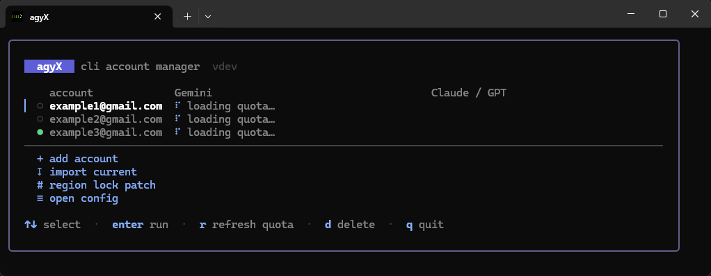

<p align="center">
  
</p>

<h1 align="center">agyX</h1>

<p align="center">
  CLI account manager for Antigravity <code>agy</code> and the IDE on Windows.<br>
  Pick an account, see its quota, launch — two keypresses.
</p>

<p align="center">
  <a href="CHANGELOG.md"></a>
  
  
  
  <a href="README.ru.md"></a>
</p>

<p align="center">
  If agyX was useful, give the repo a <b>★ star</b>.
</p>

---

<p align="center">
  
</p>

`agy` keeps one signed-in Google account at a time. agyX stores each account
once in an encrypted vault, shows the live quota of every account side by
side, and swaps the active one before launching `agy` — for the CLI and for
the Antigravity IDE.

## Features

- **Quota**
- **CLI + IDE**
- **Region lock patch**
- **Encrypted vault**
- **English / Russian**

## Install

Download `agyx.exe` from [Releases](../../releases).

```powershell
.\agyx.exe            # portable, runs from anywhere
.\agyx.exe install    # or add it to PATH (%LOCALAPPDATA%\Programs\agyx)
```

`agyx uninstall` removes the copy and the PATH entry; `~/.agyx` stays.

<details>
<summary>Build from source</summary>

Go 1.24+.

```powershell
git clone https://github.com/dycops/agyx.git
cd agyx
.\build.ps1            # stamps the version from the latest git tag
                       # from Git Bash: powershell -File ./build.ps1
.\agyx.exe install
```

A plain `go build -o agyx.exe .` works too and reports version `dev`.
</details>

## Quick start

```
agyx setup-oauth   # once: extract the OAuth client into ~/.agyx/oauth.json
agyx add           # sign a Google account in via the browser
agyx add           # add another one (the browser lets you pick)
agyx               # pick an account, switch, launch agy
```

`setup-oauth` reads Antigravity's OAuth client from a local install (Manager,
IDE, or `agy.exe`) and writes it to `oauth.json`. That file is portable: copy
it to another machine and `agyx add` works there with only `agy` installed.

## Picker keys

| key | action |
|---|---|
| `↑` `↓` / `j` `k` | move |
| `enter` | switch to the account and launch `agy` (or run the action) |
| `r` | refresh quota, bypassing the cache |
| `d` | delete the highlighted account (`y` confirms) |
| `q` `esc` | quit |

## Commands

```
agyx                 pick an account and launch agy with the default args
agyx <agy args...>   same, extra args appended for agy
agyx --plain [...]   launch agy without the default args (-p)
agyx add [label]     browser sign-in for a new account, then save it
agyx import [label]  save the account currently in the credential slot
agyx list            list saved accounts
agyx rm <email>      remove an account from the vault
agyx current         show the active account
agyx quota           print the active account's quota by group and window
agyx ide             write the active account into Antigravity IDE (IDE closed)
agyx patch           region lock patch: stop Antigravity, set CLOUD_CODE_URL, patch binaries
agyx config          show settings;  agyx config args <...> sets agy args
agyx open-config     open config.json in $EDITOR / Notepad
agyx setup-oauth     one-time OAuth client extraction into oauth.json
agyx install         copy agyx to %LOCALAPPDATA%\Programs\agyx and add it to PATH
agyx uninstall       remove that copy and the PATH entry (vault stays)
agyx version         print version
```

## Configuration

`~/.agyx/config.json` is created on first run:

```json
{
  "agy_args": ["--dangerously-skip-permissions"],
  "quota_ttl_sec": 60,
  "switch_ide": true,
  "auto_patch": false,
  "agy_autoupdate": false
}
```

| key | meaning |
|---|---|
| `agy_args` | arguments prepended to every `agy` launch; `[]` for none |
| `quota_ttl_sec` | how long quota is cached; `0` always refetches |
| `switch_ide` | also write the account into Antigravity IDE on switch (IDE must be closed; skipped with a note otherwise) |
| `auto_patch` | re-apply the region lock patch to `agy.exe` before each launch if an update replaced it |
| `agy_autoupdate` | `false` launches `agy` with `AGY_CLI_DISABLE_AUTO_UPDATE=1` so the patched binary stays; `true` lets it update |

Language follows `AGYX_LANG`, then `LC_ALL`, `LC_MESSAGES`, `LANG` —
anything starting with `ru` selects Russian.

```powershell
$env:AGYX_LANG = "ru"; agyx
```

## How it works

- **Vault** — `~/.agyx/vault.bin`, JSON encrypted with Windows DPAPI
  (bound to your user). One entry per account: email, the credential value
  exactly as `agy` wrote it, timestamp.
- **CLI switch** — the Credential Manager entry `gemini` / `antigravity` is
  rewritten with go-keyring, the same library `agy` uses, so the value
  round-trips unchanged. Before switching away, the live value is snapshotted
  back into the vault so refreshed tokens are not lost.
- **IDE switch** — `%APPDATA%\Antigravity IDE\User\globalStorage\state.vscdb`
  gets `antigravityUnifiedStateSync.oauthToken` / `userStatus` rewritten as the
  IDE's protobuf envelope (what Antigravity Manager does); a one-time
  `state.vscdb.agyx.bak` is kept.
- **Quota** — `cloudcode-pa.googleapis.com` `loadCodeAssist` +
  `retrieveUserQuotaSummary`, identified by the Antigravity User-Agent. Only
  percentages and reset times are cached (`quota.json`), never tokens.
- **OAuth** — the Authorization Code flow on a `127.0.0.1` loopback port with
  Antigravity's public client id and its app secret from `oauth.json`.

## Files

```
~/.agyx/
  vault.bin     DPAPI-encrypted account vault
  oauth.json    OAuth client id + secret (app credential, portable)
  config.json   settings
  quota.json    quota cache (percentages and reset times only)
```

## Support

If agyX was useful, star the repo. Bugs and ideas — Issues.

## License

MIT
